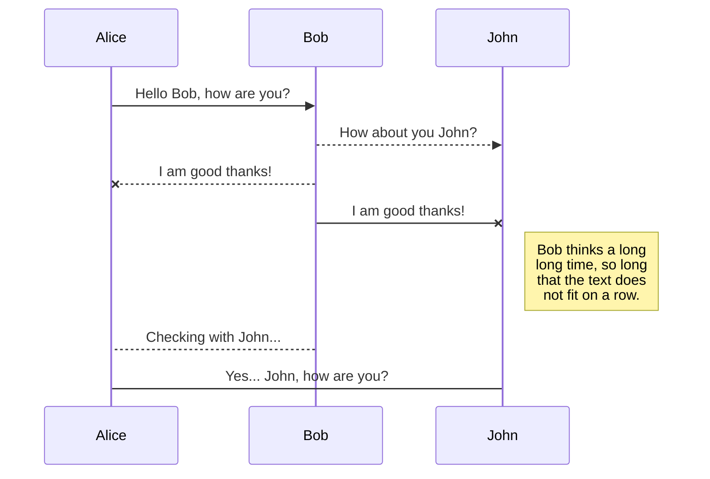
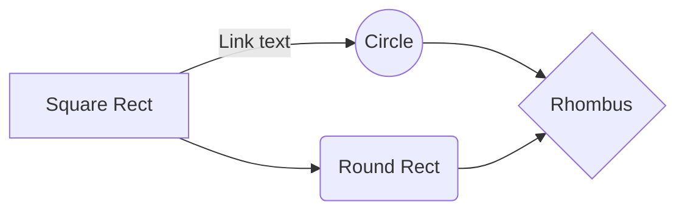

Michigan State University Superfund Research Center  
<b> MIATE_4.1.3 Contextual Data Curation </b>

## Contextual Data (Metadata) Curation

I. **Purpose:** To harmonize the metadata collection accross rodent in vitro experiments
 sadfsdfsfsdf.  
	a.  sdfsdfsd
	b. asdsasdas
	c. adsadsda
II. **Data:** asdsadas  
III. **Procedure:** sadsadassada  

---
#### 1.  Downloading 
Download the zip file (“Source code (zip))” containing The DataHarmonizer application from the following link:
https://github.com/Public-Health-Bioinformatics/covid19ValidationGrid/releases

Extract the zip file’s contents, and navigate into the extracted folder. Open main.html. The validator application will open in your default browser. It should look like this:  

Data can be entered into the validator application manually, by typing values into the application’s spreadsheet, or data can be imported from local xlsx, xls, tsv and csv files. To import local data, click File on the top-left toolbar, and then click Open. To enter data in a new file, click File on the top-left toolbar, and then click New. Data entered into the spreadsheet can be copied and pasted. Note: Only files containing the headers expected by the DataHarmonizer can be opened in the application. Example:

_Note: Only files containing the headers expected by the DataHarmonizer can be opened in the application. Example:_

_If you are missing the first row, you will get the following warning:_

_Resolve by declaring “1” as the row in which your column headers reside._

#### 2.  Before adding metadata
Before you begin to curate sample metadata: 
- Review your dataset 
- Review the fields in the template of the Validator application 
- Review the field descriptions in the SOP Appendix

#### 3.  Before adding metadata
Familiarize yourself with DataHarmonizer functionality by reviewing the “Getting Started”. To access "Getting Started", click on the green Help button on the top-left toolbar, then click Getting Started. Definitions, examples and further guidance are available by double clicking on the field headers, or by using the “Reference Guide”. To access the “Reference Guide” click on the Help button, then click Reference Guide.

> **Note:** The **Publish now** button is disabled if your file has not been published yet.

## SmartyPants

SmartyPants converts ASCII punctuation characters into "smart" typographic punctuation HTML entities. For example:

|                |ASCII                          |HTML                         |
|----------------|-------------------------------|-----------------------------|
|Single backticks|`'Isn't this fun?'`            |'Isn't this fun?'            |
|Quotes          |`"Isn't this fun?"`            |"Isn't this fun?"            |
|Dashes          |`-- is en-dash, --- is em-dash`|-- is en-dash, --- is em-dash|

## UML diagrams

You can render UML diagrams using [Mermaid](https://mermaidjs.github.io/). For example, this will produce a sequence diagram:

And this will produce a flow chart:

