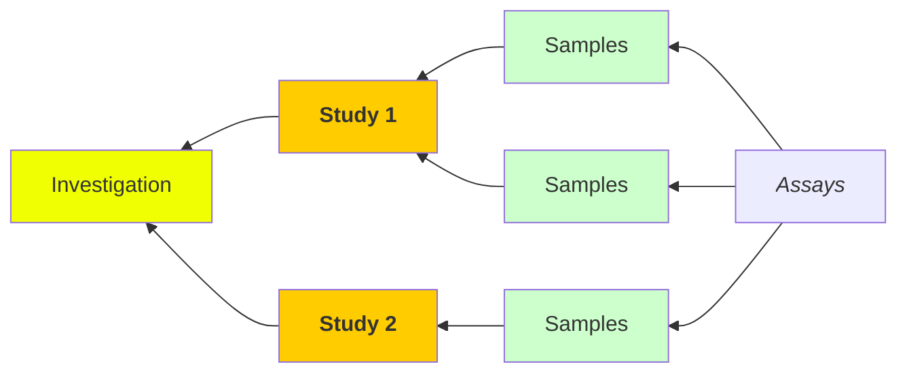

<p align="center">
Michigan State University Superfund Research Center <br>
<b> MIATE_4.1.3 Contextual Data Curation </b>
</p>

## Contextual Data (Metadata) Curation

### Overview
The purpose for this template is to harmonize the metadata collection accross rodent _in vitro_ experiments related to environmental health sciences including dose-response, time-course, and other chemical or drug treatment types of study design intended to evaluate the biological effects of that substance. 

__Data generators__ are expected to enter the relevant metadata as outlined in the steps below.
> All data is provided by the data generators who are responsible for its accuracy at time of collection. 

Templates will be implemented using [_DataHarmonizer_](https://github.com/cidgoh/DataHarmonizer) and cite the following when publishing the data: 
```
@article{,
   author = {Gill, I. S., Griffiths, E. J., Dooley, D., Cameron, R., Savic Kallesoe, S., John, N. S., Sehar, A., Gosal, G., Alexander, D., Chapel, M., Croxen, M. A., Delisle, B., Di Tullio, R., Gaston, D., Duggan, A., Guthrie, J. L., Horsman, M., Joshi, E., Kearny, L., Knox, N., Lau, L., LeBlanc, J. J., Li, V., Lyons, P., MacKenzie, K., McArthur, A. G., Panousis, E. M., Palmer, J., Prystajecky, N., Smith, K. N., Tanner, J., Townend, C., Tyler, A., Van Domselaar, G. and Hsiao, W. W. L.},
   title = {The DataHarmonizer: a tool for faster data harmonization, validation, aggregation and analysis of pathogen genomics contextual information.},
   journal = {Microb Genom},
   pages = {},
   DOI = {10.1099/mgen.0.000908},
   url = {},
   year = {2023},
   type = {Journal Article}
}
```


---
### Table of Contents
1. [Usage](#usage)
	a. [Getting to know _DataHarmonizer_](#familiorize)
	b. [Loading the MIATE templates](#starting)
	c. [Before adding metadata](#before)
	d. [Populating the templates](#populating)
	e. [Missing metadata](#missing)
	f. [MIATE organization](#structure)
2. [FAQ](#faq)
3. [Record of Changes](#changes)

---
### Usage

 <a id="familiorize"></a>
#### 1.  Familiarize yourself with _DataHarmonizer_<br>

Before beginning to collect your (meta)data it is strongly recommended that you familiarize yourself with [_DataHarmonizer_](https://github.com/cidgoh/DataHarmonizer#usage) created by the Centre for Infectious Disease Genomics and One Health (CIDGOH), at Simon Fraser University. We've prepared a brief video overview for your reference.

[](https://www.youtube.com/watch?v=YOUTUBE_VIDEO_ID_HERE)

##### _Notes_:
- DataHarmonizer will not save your progress. It is good practice to save your work and upload the output next time you want to work on (meta)data collection.
- If you decide to fill some of the data offline using Excel, ensure that you meet the expectations for individual fields. These can be verified by uploading and validating.

 <a id="starting"></a>
#### 2.  Loading the Minimum Information about Animal Toxicology Experiments (MIATE) template<br>

Go to the [Superfund Research Center_DataHarmonizer site](http://52.90.28.252:8080/). It should look like the following screenshot.


The template section will present all catalogued EHS templates. MIATE contains 3 sub-templates: 
- **Investigation (miate/Investigation):** Here you will enter the investigation level information which can include multiple studies (i.e., experiments) and samples. Please record the identifier used for later use.
- **Study (miate/Study)**: Here will be the subject level metadata (i.e., individual mouse). Each individual will have to be linked to an investigation and each row assigned a unique identifier. One individual may receive multiple unique identifiers if it was treated multiple times or underwant multiple procedures.
- **Sample (miate/study)**: dfsfdfs



 <a id="before"></a>
#### 2.  Before adding metadata<br>
Before you begin to add your metadata: 
- Review the fields in the template of the Validator application. For a summary overview you can select the `Reference Guide` from the `Help` menu.

- Review this protocol to make sure that you are using the template as intended.
- Review your dataset. 

 <a id="populating"></a>
#### 3. Populating the template
#####  <uL>3A. Direct entry:
<ul><ul> The template can be used as a typical excel template with some limited function. 

#####  <uL>3B. (Meta)data import:
<ul><ul> Using the `Save As...` option in the `File` menu  you can export a template to use for populating. It will be missing some of the dropdown menus so you will have to confirm that your selections are valid. This can be done either by looking up the value or by uploading your template and choosing the `Validate` button. 

#####  <uL>3C. Hybrid:

<a id="missing" ></a>
#### 3.  Unavailable or missing metadata
- Every __required field__ must have a value. If this information is missing then please select a null value from the dropdown menu indicating where it is:
	- Not applicable 
	- Missing
	- Not collected
	- Not provided
	- Restricted acces

> __If a term is missing in either a dropdown menu as a column in the _DataHarmonizer_ template please submit a Github _issue_ or contact [Rance Nault](mailto:naultran@msu.edu)__ 

<a id="structure" ></a>
#### 4.  Template organization
| Class | Subsection  | Required fields |
|-------|---------------|---------------|
| Investigation | Contact| Name, ORCID  |
|               | Funding |             |
|               | Publication |         |   
| Study| Identifiers | Investigation_name, study_identifer, __record_identifier__ |
| | experiment | organism |
|  | subject | subject_identifier, sex, strain |
|Sample| identifiers | study_identifier, subject_identifier, __sample_identifier__ |

__bold__ indicates a unique identifier to be used as key for database records.

### Record of changes


