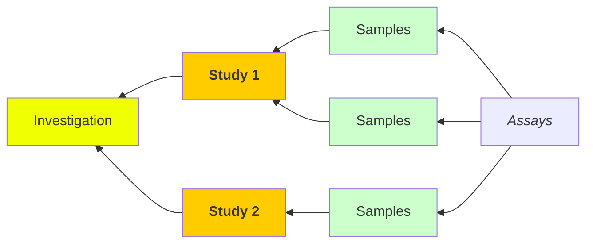
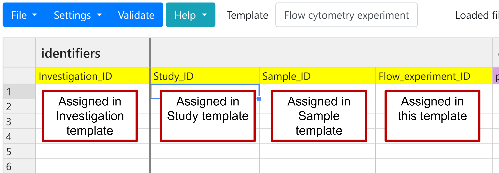
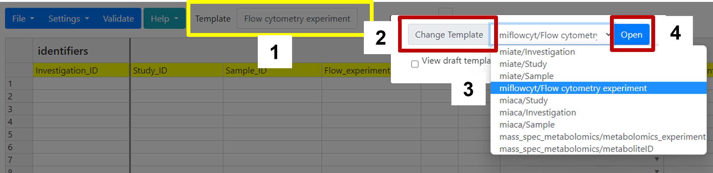
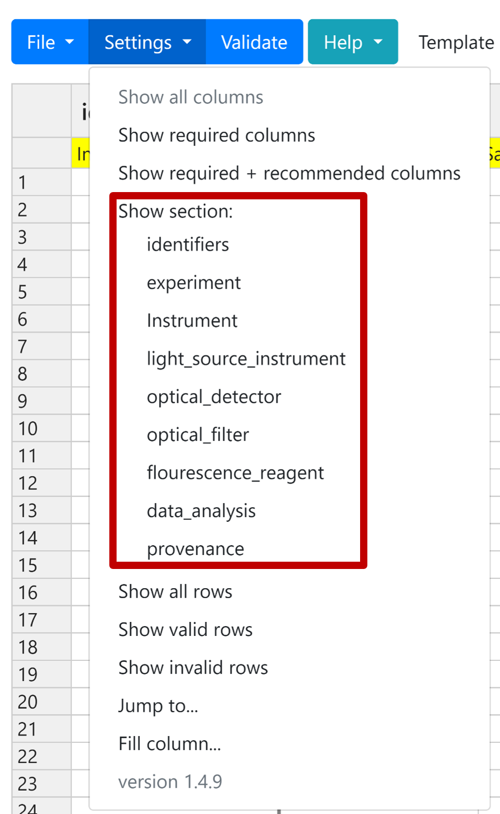

<p align="center">
Michigan State University Superfund Research Center <br>
<b> MIFlowCyt_1.0.0 Contextual Data Curation </b>
</p>

## Contextual Data (Metadata) Curation

### Overview
The purpose for this template is to harmonize the metadata collection for flow cytometry analyses and support the submission to the International Society for Advancement of Cytometry (ISAC) [FLOWRepository](flowrepository.org). 
> Metadata will be provided by the data generators who are responsible for its accuracy at time of collection. 

This  MIFlowCyt template developed by the [Michigan Sate University Superfund Research Center Data Management and Analysis Core](https://iit.msu.edu/centers/superfund/) is intended to be used with [_DataHarmonizer_](https://github.com/cidgoh/DataHarmonizer): 
```
@article{,
   author = {Gill, I. S., Griffiths, E. J., Dooley, D., Cameron, R., Savic Kallesoe, S., John, N. S., Sehar, A., Gosal, G., Alexander, D., Chapel, M., Croxen, M. A., Delisle, B., Di Tullio, R., Gaston, D., Duggan, A., Guthrie, J. L., Horsman, M., Joshi, E., Kearny, L., Knox, N., Lau, L., LeBlanc, J. J., Li, V., Lyons, P., MacKenzie, K., McArthur, A. G., Panousis, E. M., Palmer, J., Prystajecky, N., Smith, K. N., Tanner, J., Townend, C., Tyler, A., Van Domselaar, G. and Hsiao, W. W. L.},
   title = {The DataHarmonizer: a tool for faster data harmonization, validation, aggregation and analysis of pathogen genomics contextual information.},
   journal = {Microb Genom},
   pages = {},
   DOI = {10.1099/mgen.0.000908},
   url = {},
   year = {2023},
   type = {Journal Article}
}
```


---
### Table of Contents
1. [Usage](#usage)<br>
	a. [Getting to know _DataHarmonizer_](#familiorize)<br>
	b. [Collecting __investigation__ and __study__ level metadata](#isa)<br>
	c. [Loading the MIFloCyt templates](#starting)<br>
	d. [Before adding metadata](#before)<br>
	e. [Populating the templates](#populating)<br>
	f. [Missing metadata](#missing)<br>
	g. [MIATE organization](#structure)<br>
2. [FAQ](#faq)<br>
3. [Record of Changes](#changes)<br>

---
### Usage

 <a id="familiorize"></a>
#### 1.  Familiarize yourself with _DataHarmonizer_<br>

Before beginning to collect your (meta)data it is strongly recommended that you familiarize yourself with [_DataHarmonizer_](https://github.com/cidgoh/DataHarmonizer#usage) created by the Centre for Infectious Disease Genomics and One Health (CIDGOH), at Simon Fraser University. See the following video for an overview of _DataHarmonizer_.

[Click here for _DataHarmonizer_ video](https://youtu.be/rdN2_Vhwb8E)

#### _Notes_:
- __DataHarmonizer will not save your progress.__ It is good practice to save your work and upload the output next time you want to work on (meta)data collection.
- If you decide to fill some of the data offline using Excel, ensure that you meet the expectations for individual fields. These can be verified by uploading and validating.


<a id="isa"></a>
#### 2. Collecting _investigation_ and _study_ level metadata


The MIFlowCyt template is intended to collect __Assay__ level data and __must be complemented with study level data__. For study level data please see the [_Minimum information about animal toxicology experiments (MIATE)_](https://github.com/naultran/ToxRSCat/tree/main/templates/miate#readme) or [_Minimum information about cellular assays (MIACA)_](https://github.com/naultran/ToxRSCat/tree/main/templates/miate#readme) templates. This template will ask for identifiers which were assigned in these other templates as shown in the following image:



 <a id="starting"></a>
#### 2.  Loading the Minimum Information about Flow Cytometry Experiments (MIFlowCyt) template<br>

Go to the [Superfund Research Center_DataHarmonizer site](http://52.90.28.252:8080/) and choose the __MIFlowCyt__ template from the menu bar as shown below. 



This will load the template into the browser. The template is broken down into __9 sections__ which you can display at the same time or choose to display specific sections as shown here.



> Here you can also choose to display only required, recommended, or required+recommended columns.

The sections broadly capture the following. For more details see [_section 6_](#structure).
- **Identifiers:** Here you will enter all the relevant identifiers to map the data to individual samples/subjects, funding source, project details, etc. You will also assign a unique identifier to each row.
- **Experiment**: Here you will enter the general details about the experiment such as the purpose, contact person, QC procedures, and major conlusions. This is required for upload to [FLOWrepository](flowrepository.org)
- **Fluorescence reagent**: Enter details about the reagents used to detect the molecule or process of interest.
- **Data analysis**: Here you will include analysis procedures including raw and procesed data file names.
- **Instrument**: Here you will enter the general details about the  flow cytometer such as vendor, model, flow cell etc.
- **Light source (instrument)**: Enter details about the flow cytometer light source.
- **Optical detector (instrument)**: Enter details about the flow cytometer optical detector.
- **Optical filter (instrument)**: Enter details about the flow cytometer optical filter.
- **Provenance**: _This is autopopulated, please do not fill_.

 <a id="before"></a>
#### 3.  Before adding metadata<br>
Before you begin to add your metadata: 
- Review the fields in the template of the Validator application. For a summary overview you can select the `Reference Guide` from the `Help` menu.
 


- Review this protocol to make sure that you are using the template as intended.
- Review your dataset. 

 <a id="populating"></a>
#### 4. Populating the template
#####  <uL>4A. Direct entry:
<ul><ul> The template can be used as a typical excel template with some limited function.  Simply type, copy & paste, or choose from dropdown menus to fill the relevant fields in the template. You can also copy from an excel document on your own computer. 

For more information about the columns `double click` on the column name. This will describe the column and provide some examples.

To add multiple values (when allowed), seperate the values using the `;` character.

To delete an item from a dropdown menu, select it and hit the `delete` button on your keyboard.  


#####  <uL>4B. (Meta)data import:
<ul><ul> Using the `Save As...` option in the `File` menu  you can export a template to use for populating. It will be missing some of the dropdown menus so you will have to confirm that your selections are valid. This can be done either by looking up the value or by uploading your template and choosing the `Validate` button. 

#####  <uL>4C. Hybrid: 

> In development

<a id="missing" ></a>
#### 5.  Unavailable or missing metadata
- Every __required field__ must have a value. If this information is missing then please select a null value from the dropdown menu indicating where it is:
	- Not applicable 
	- Missing
	- Not collected
	- Not provided
	- Restricted acces

> __If a term is missing in either a dropdown menu as a column in the _DataHarmonizer_ template please submit a Github _issue_ or contact [Rance Nault](mailto:naultran@msu.edu)__ 

<a id="structure" ></a>
#### 6.  Template organization
| Section  | Required fields |
|----------|-----------------|
| Indentifiers | __flow_experiment_id__, investigation_id, study_id, sample_id |           
| Experiment | experimentVariables, primaryContact, qualityControlMeasures |
| Fluorescence_reagent | analyte, detector, analyteReporter |
| Data_analyis | |
| Instrument| |
| Light_source_instrument |  |
| Optical_detector | |
| Optical_filter | |
|  Provenance | |

__bold__ indicates a unique identifier to be used as key for database records.

### Record of changes

