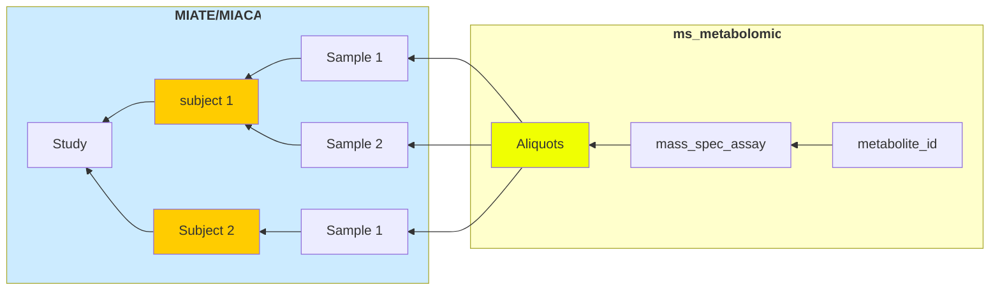

Michigan State University Superfund Research Center  
<b> CIMR_1.0.0 Contextual Data Curation </b>

## Contextual Data (Metadata) Curation

       <strong>🚧 This repository is a work in progress 🚧</strong>    Please check in regularly for updates .  If you have any questions feel free to contact the ToxRSCat team using <i>issues</i> or by email.

---
### Table of Contents
1. [Overview](#overview) 
1. [Usage](#usage) 
	a. [Getting to know _DataHarmonizer_](#familiorize) 

### Overview
The purpose for this template is to harmonize the metadata collection for metabolomics experiments performed using mass spectrometry and support the submission to the [Metabolomics Workbench](https://www.metabolomicsworkbench.org/) repository. 

These templates were developed by the [Michigan Sate University Superfund Research Center Data Management and Analysis Core](https://iit.msu.edu/centers/superfund/) and are intended to be used with [_DataHarmonizer_](https://github.com/cidgoh/DataHarmonizer): 

---
### How to use the metabolomics templates
> :bulb: **We're testing out Scribe! [Click here](https://scribehow.com/embed/Mass_Spectrometry_metadata_collection__yfuie1rTSrK4OJ26z6t9PQ?skipIntro=true) for a quick walkthrough.**

 
#### 1.  Familiarize yourself with _DataHarmonizer_ 

Before beginning to collect your (meta)data it is strongly recommended that you familiarize yourself with [_DataHarmonizer_](https://github.com/cidgoh/DataHarmonizer#usage) created by the Centre for Infectious Disease Genomics and One Health (CIDGOH), at Simon Fraser University. See the following video for an overview of _DataHarmonizer_.

[Click here for _DataHarmonizer_ video](https://youtu.be/rdN2_Vhwb8E)

#### _Notes_:
- __DataHarmonizer will not save your progress.__ It is good practice to save your work and upload the output next time you want to work on (meta)data collection.
- If you decide to fill some of the data offline using Excel, ensure that you meet the expectations for individual fields. These can be verified by uploading and validating.